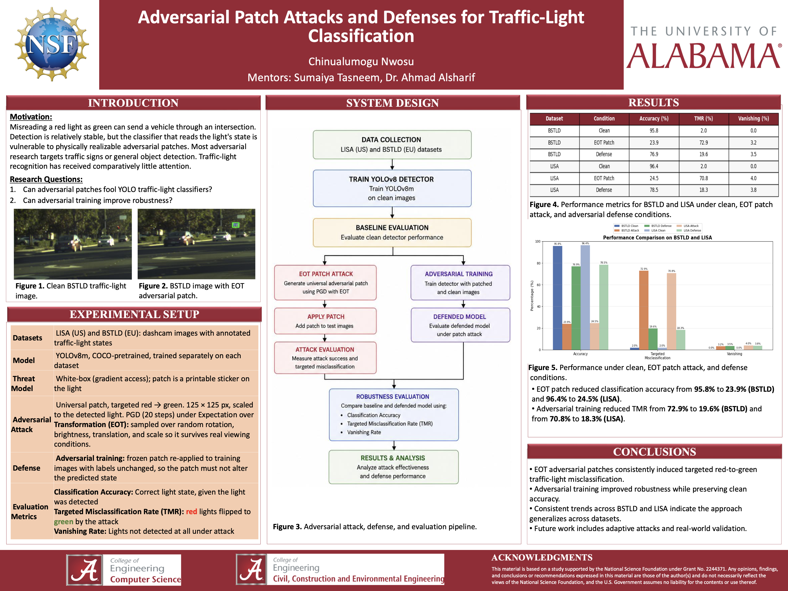

# Traffic Light Adversarial Defense


<p align="center">
  
</p>

<p align="center">
  <b>Summer 2026 REU Research Poster</b><br>
  <a href="publication/poster.pdf">View Full Poster (PDF)</a>
</p>

---

## Overview

This repository contains the code, experiments, and research materials developed during my Summer 2026 Research Experience for Undergraduates (REU).

The project investigates the vulnerability of YOLOv8 traffic light detection models to universal adversarial patch attacks and explores adversarial training as a defense mechanism. Experiments were conducted using the Bosch Small Traffic Lights Dataset (BSTLD) and the LISA Traffic Light Dataset to evaluate attack effectiveness, robustness, and cross-dataset transferability.

---

## Research Objectives

- Evaluate the robustness of YOLOv8 traffic light detectors
- Generate universal adversarial patches using Expectation over Transformation (EOT)
- Measure attack success on BSTLD and LISA
- Improve robustness through adversarial training
- Study attack transferability across datasets and models

---

## Repository Structure

```text
traffic-light-adversarial-defense/
├── configs/          Training and experiment configurations
├── datasets/         Dataset setup instructions
├── docs/             Project documentation
├── experiments/      Dataset-specific experiments
├── models/           Model checkpoints (optional)
├── publication/      Poster and publication materials
├── results/          Figures, tables, and evaluation results
├── scripts/          Training, attack, and evaluation code
├── README.md
├── requirements.txt
└── environment.yml
```

---

## Experimental Pipeline

1. Train a baseline YOLOv8 detector.
2. Generate universal adversarial patches using EOT.
3. Evaluate attack performance on BSTLD.
4. Test transferability using the LISA dataset.
5. Retrain using adversarial training.
6. Compare robustness before and after defense.

---

## Results

The generated adversarial patches significantly reduced YOLOv8 detection performance on both BSTLD and LISA.

Adversarial training substantially improved robustness while maintaining strong performance on clean images.

Additional quantitative results, figures, and analyses will be added as the repository continues to be prepared for publication.

---

## Datasets

- Bosch Small Traffic Lights Dataset (BSTLD)
- LISA Traffic Light Dataset

The datasets are not distributed with this repository because of licensing and storage limitations. Please download them from their official sources before running the experiments.

---

## Current Status

### Completed

- Baseline YOLOv8 training
- Universal adversarial patch implementation
- EOT optimization
- BSTLD evaluation
- LISA evaluation
- Adversarial training

### In Progress

- Transferability analysis
- Repository cleanup
- Reproducibility improvements
- Manuscript preparation

---

## Citation


BibTeX will be added upon publication.
